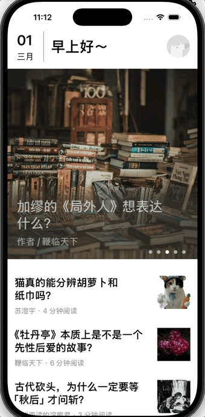
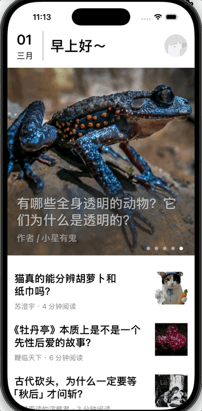
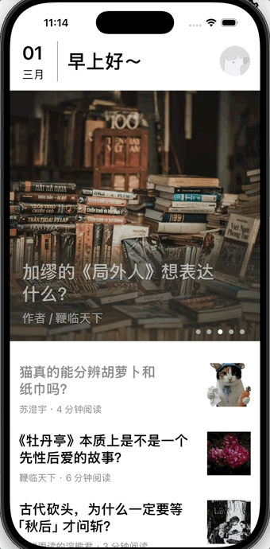
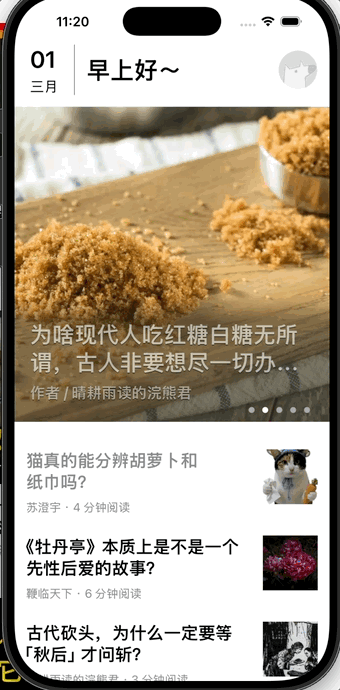

# ZHDailyNews
一.APP简要功能介绍：
1.首页（轮播图+新闻列表）

2.新闻详情页（跳转到知乎查看原文+底部工具栏）

3.登录界面+夜间模式

二.APP构成板块及开发思路
1.首页构成：
顶部轮播图：
SDCycleScrollView + 自定义UICollectionViewCell
SDCycleScrollView实现网络请求返回数据中的top_stories所包含图片的无限轮播
自定义cell实现每张图片对应新闻的标题及作者信息的显示

最顶部当日日期、问候语及跳转到登录界面的默认头像按钮：
当日日期与问候语采用普通的UIView布局，通过NSDateFormatter将返回的20260222这种类型的数据转换为需要展示的“二月”，“22”等数据
通过NSdate和NSCalendar中的相关方法实时获取用户当前的时间（小时），根据当前时间确定问候语的显示
点击默认头像按钮后跳转到登录界面是通过在view里为点击事件添加一个block代码块（记录登录信息），然后在ViewController里通过navigationController的pushViewController方法实现跳转

往期新闻：
通过before/date的方式请求往期新闻数据，将请求到的数据中的date字符串赋值给前面用到的字符串对象，实现无限刷新往期新闻的数据
往期新闻间的日期分割线采用和顶部日期相同的NSDateFormatter方法实现

2.新闻详情页：
顶部HeaderView：
利用SDWebImage下载并显示图片，图片上的新闻标题显示方式与首页采用的相同方式
下方跳转到知乎的蓝色字体通过UIButton实现
在detailViewController里为其添加点击事件：点击时通过UIApplication打开相应的url

中间网页内容：
利用前端知识处理详情页接口返回的html和css数据

底部工具栏：
五个按钮：
返回按钮：点击时触发navigationController的popViewController方法回到上一页面
评论按钮：点击触发navigationController的pushViewController方法跳转到CommentViewController
点赞按钮：点击切换图片样式，通过MBProgressHUD实现成功点赞和取消点赞的弹窗
收藏按钮：弹窗效果的实现与点赞按钮同理
分享按钮：点击后弹出一个自定义的shareView,shareView底部是一个白色背景的collectionView来展示自定义的shareCell，上面其余部分添加阴影效果和点击后收起弹窗的效果
评论按钮和点赞按钮右上角的评论数与点赞数通过story-extra请求数据后填充

3.登录界面：
中间的提示文字及相关按钮都集成在loginMainView里，方便布局
相关协议通过富文本（NSMutableAttributedString）实现相关字体变蓝并可通过点击跳转到相关协议界面

夜间模式：点击后记录当前按钮状态，退出后重新点进登录界面仍可保留之前的状态
具体实现：将背景设置为systemBackgroundColor,其余颜色设置为labelColor 当点击按钮时根据按钮状态设置整个应用界面的颜色状态，实现夜间模式的切换

较为重要的开发工具：
1.AFNetWorking:用于网络请求获得初始数据
2.YYModel:用于将网络请求返回的json数据直接转化为相应的model对象
3.SDWebImage:实现异步下载图片并缓存
4.Masonry:自动布局，可实现不同机型的适配
5.MJRefresh:实现下拉刷新和上拉加载更多
6.SDCycleScrollView:实现轮播图的无限轮播效果
7.Ono:可以直接从复杂的css和html文件中提取需要的关键内容
8.MBProgressHUD:实现点击按钮后出现的弹窗效果
9.MVC开发框架

心得体会：
在这整个寒假的开发过程中，我不仅实现了从零到一的功能搭建，更在解决复杂 UI 布局、多方库集成以及项目规范化管理方面积累了宝贵的经验。以下是我的核心感悟：
1. 深度掌握 MVC 架构
项目采用 MVC 开发框架，使我深刻理解了职责分离的重要性。
模型 (Model)：利用 YYModel 实现 JSON 到 Model 的自动化转换，极大地简化了数据处理逻辑。
视图 (View)：利用SDCycleScrollView实现无限轮播，使用SDWebImage实现异步下载图片并缓存等等第三方库的使用，大大简化了开发逻辑，极大的减少了代码量
控制器（controller）:学习并掌握了navigationController的相关知识和应用，学会利用push和pop方法实现跳转和返回相应界面，大大加深了对于应用程序执行方式的认知和了解
教训：最初在布局和点击事件的数据传递和处理方面出现大量逻辑漏洞，不知如何处理
成长：最终通过查阅相关资料学习到了masnory自动布局库和block回调代码块的相关知识，弥补思维漏洞的同时也优化了我的项目代码，使我了解到了许多未曾接触过的开发知识

2. Auto Layout 与 Masonry 的进阶实践
通过 Masonry 实现全机型适配，我学会了如何处理复杂的动态 UI：
动态性：利用 NSDateFormatter 和 NSCalendar 实时计算日期与问候语，结合 Masonry 动态调整首页 Header 的显示。
调试力：学会了阅读 Xcode 控制台的约束冲突日志。并根据分析解决相关问题

3. 第三方库的深度集成与优化
项目集成了一系列主流开发工具（如 AFNetworking, SDWebImage, SDCycleScrollView, MJRefresh 等），这提升了我的工程化能力：
性能意识：使用 SDWebImage 实现图片的异步下载与缓存，确保了首页在加载大量往期新闻时的流畅性。
交互细节：利用 MBProgressHUD 细化点赞、收藏等操作的反馈，以及通过 Ono 精准提取 HTML/CSS 内容，提升了用户阅读体验。

总结
ZHDailyNews 不仅仅是一个知乎日报的克隆版，更是我从“只会写代码”向“会做架构、会调布局、会管项目”转变的转折点。每一次约束报错的红字，每一次UI无法加载的经历，都是我通往专业开发者之路的基石。
